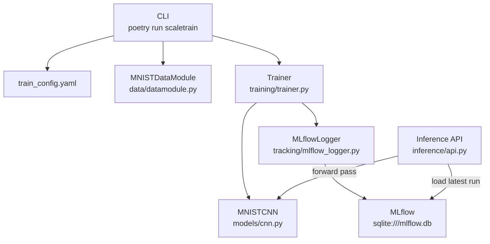

# ScaleTrain

A modular PyTorch training system with distributed training, MLflow experiment tracking, a FastAPI inference service, and Docker support.

---

## Overview

ScaleTrain is a production-oriented ML infrastructure project built to demonstrate clean separation between training, tracking, data, and inference concerns. It supports single-process and multi-process distributed training via PyTorch DDP, logs all metrics and model artifacts to MLflow, and exposes trained models through a typed REST API.

---

## Architecture



---

## Project Structure

```
scaletrain/
├── Dockerfile
├── .dockerignore
├── pyproject.toml
├── poetry.lock
└── src/
    └── scaletrain/
        ├── configs/
        │   └── train_config.yaml
        ├── data/
        │   └── datamodule.py        # MNISTDataModule, MNISTDataConfig
        ├── models/
        │   └── cnn.py               # MNISTCNN (Conv → Pool → Linear)
        ├── tracking/
        │   └── mlflow_logger.py     # MLflowLogger, MLflowConfig
        ├── training/
        │   ├── train.py             # Typer CLI entry point
        │   └── trainer.py           # Trainer, TrainingConfig
        └── inference/
            └── api.py               # FastAPI app, /predict endpoint
```

---

## Stack

| Component | Technology |
|---|---|
| Training | PyTorch |
| Distributed training | PyTorch DDP + `torchrun` (gloo backend) |
| Experiment tracking | MLflow (SQLite backend) |
| Inference API | FastAPI + Uvicorn |
| CLI | Typer |
| Package management | Poetry |
| Container | Docker (python:3.11-slim) |

---

## Setup

### Requirements

- Python 3.11
- Poetry

### Install

```bash
git clone https://github.com/ashah5123/scaletrain.git
cd scaletrain
poetry install
```

---

## Training

### Configuration

All training parameters are controlled via `src/scaletrain/configs/train_config.yaml`:

```yaml
training:
  epochs: 3
  lr: 0.001
  weight_decay: 0.0
  device: "auto"          # auto | cpu | cuda | mps
  log_every_n_steps: 50
  distributed: false

mlflow:
  tracking_uri: "sqlite:///mlflow.db"
  experiment_name: "scaletrain"
  run_name: "mnist-cnn"
```

`device: auto` selects MPS on Apple Silicon, CUDA on Linux with GPU, and CPU otherwise.

### Single-process

```bash
poetry run scaletrain
```

With a custom config:

```bash
poetry run scaletrain --config path/to/config.yaml
```

### Distributed (multi-process DDP)

Set `distributed: true` in the config, then launch with `torchrun`:

```bash
torchrun --nproc_per_node=2 -m scaletrain.training.train
```

Each process initializes via the `gloo` backend (CPU). Only rank 0 logs metrics and artifacts to MLflow.

Per-epoch output (rank 0):

```
epoch 1/3  train_loss=0.1843  val_loss=0.0721  val_acc=0.9779
epoch 2/3  train_loss=0.0612  val_loss=0.0498  val_acc=0.9841
epoch 3/3  train_loss=0.0441  val_loss=0.0431  val_acc=0.9863
```

---

## Experiment Tracking

MLflow logs per-epoch metrics (`train_loss`, `val_loss`, `val_accuracy`), all hyperparameters, and the trained model artifact on every run.

### View runs

```bash
poetry run mlflow ui --backend-store-uri sqlite:///mlflow.db
```

Open `http://localhost:5000` to browse experiments and compare runs.

---

## Inference API

The inference server loads the most recently finished MLflow run at startup. The model is loaded once and held in application state — not reloaded per request.

### Start the server

```bash
poetry run uvicorn scaletrain.inference.api:app --host 0.0.0.0 --port 8000
```

Override the MLflow backend via environment variable:

```bash
MLFLOW_TRACKING_URI=sqlite:///mlflow.db \
poetry run uvicorn scaletrain.inference.api:app --host 0.0.0.0 --port 8000
```

### Endpoints

| Method | Path | Description |
|---|---|---|
| `GET` | `/health` | Liveness check |
| `POST` | `/predict` | Run inference on one or more images |

### Request format

Each input is a flattened 28×28 grayscale image (784 float values, normalized to `[0, 1]`):

```bash
curl -s -X POST http://localhost:8000/predict \
  -H "Content-Type: application/json" \
  -d '{"inputs": [[0.0, 0.0, ...]]}' # 784 values per image
```

### Response

```json
{
  "predictions": [7]
}
```

---

## Docker

### Build

```bash
docker build -t scaletrain:latest .
```

### Run (single-process)

```bash
touch mlflow.db

docker run --rm \
  -v "$(pwd)/data:/app/data" \
  -v "$(pwd)/mlflow.db:/app/mlflow.db" \
  scaletrain:latest
```

### Run (distributed, 2 processes)

Set `distributed: true` in the config first, then:

```bash
touch mlflow.db

docker run --rm \
  -v "$(pwd)/data:/app/data" \
  -v "$(pwd)/mlflow.db:/app/mlflow.db" \
  --entrypoint torchrun \
  scaletrain:latest \
  --nproc_per_node=2 -m scaletrain.training.train
```

### Run inference server in container

```bash
touch mlflow.db

docker run --rm \
  -p 8000:8000 \
  -v "$(pwd)/mlflow.db:/app/mlflow.db" \
  --entrypoint uvicorn \
  scaletrain:latest \
  scaletrain.inference.api:app --host 0.0.0.0 --port 8000
```

> The `mlflow.db` file must be pre-created with `touch mlflow.db` before mounting. Docker will otherwise create it as a directory.

---

## Design Notes

- **No side effects at import time.** Model loading, dataset downloads, and process group initialization happen inside explicit lifecycle functions, not at module level.
- **DDP is opt-in.** `distributed: false` (default) gives identical single-process behavior with zero overhead.
- **Rank-0 gating.** In distributed mode, all MLflow calls, console output, and model logging are gated on `rank == 0` to prevent duplicate writes.
- **Layer-cached Docker builds.** `pyproject.toml` is copied before source code, so the heavy dependency layer is only rebuilt when dependencies change.
- **Structured logging.** Training emits JSON-structured logs (`timestamp`, `level`, `rank`, `message`) configured at startup. Non-zero DDP ranks are silenced at the logging level, not by scattering conditionals through the code.
- **Performance instrumentation.** Each epoch records `epoch_time_seconds` and `samples_per_second`; `total_training_time` is logged at run end. All three are written to MLflow alongside the standard loss/accuracy metrics.
